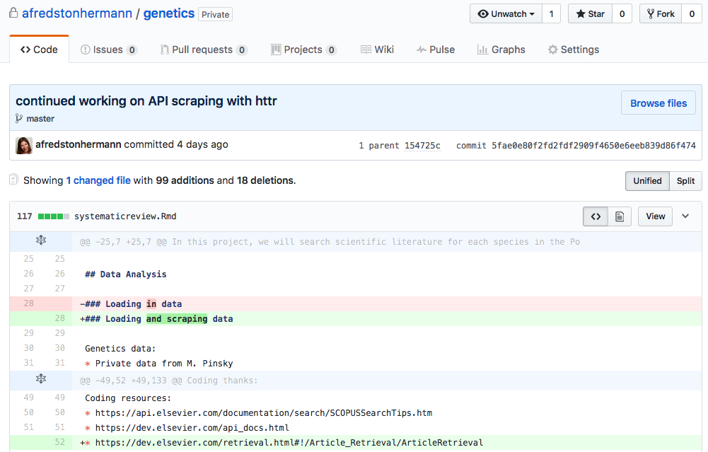

## Does this look familiar? 

Do you have a folder on your computer that looks like this?

Do you have a folder of *code* on your computer like this? 

## Why learn and use GitHub? 

GitHub enables **version control** of projects, so you can track all of your changes clearly and unambiguously, without proliferating files or losing old versions. It's used for many programming languages, although we'll only cover its interface with RStudio. 

This facilitates scientific collaboration because multiple people can work on code together, but is also a fantastic organizational tool for individuals. GitHub allows you to back up code, easily switch between computers, undo mistakes, 'comment' on changes, and much more. 

*You don't need to be proficient in R to understand this workshop!* However, if you want to follow along when we practice in RStudio, please be sure you have an updated version on your laptop. You'll also need an account on [github.com](https://www.github.com/) - feel free to navigate to this repository. Please ask questions as we go along. 

You can read more about why and how to use GitHub from [Hadley Wickham](https://github.com/rstudio/webinars/blob/master/06-Collaboration-and-time-travel-version-control/git-github.pdf), [Karl Broman](http://kbroman.org/github_tutorial/pages/why.html), and [Ben Best](http://htmlpreview.github.io/?https://github.com/eco-data-science/ds-git/blob/gh-pages/index.html). 

## What is GitHub?  
<!---To view rendered .html files, preappend http://htmlpreview.github.io/? to the url--->
<!---Make notes or comments that won't be rendered using this syntax--->

[**GitHub**](https://github.com) is an open-source development platform that enables easy collaboration and versioning, which means that all saved versions are archived and attributed to each user. It is possible to revert back to any previous version, which is incredibly useful to not only to document what work has been done, but how it differs from work done in the past, and who is responsible for the changes. Great for collaborators and your future self.

## What is GitHub?  

[**GitHub**](https://github.com) is an open-source development platform that enables easy collaboration and versioning, which means that all saved versions are archived and attributed to each user. It is possible to revert back to any previous version, which is incredibly useful to not only to document what work has been done, but how it differs from work done in the past, and who is responsible for the changes. Great for collaborators and your future self.

Similar to Dropbox, you have certain folders on your local computer that will be 'watched', with any changes able to be synced online. However, with GitHub, you have more control about what is synced, and how often. You can store, share, track changes and collaboratively edit many filetypes (including this presentation!) using any application. There are many other great features, including a to-do list you can share with collaborators (called Issues). 

## git and GitHub

  
Git is distinct from GitHub, but this is not the focus today.  
  
(definition from [GitHub.com](https://guides.github.com/introduction/getting-your-project-on-github))

## Workshop Outline

1. GitHub Structure
2. GitHub Workflow and Vocabulary
3. RStudio Practice
4. Non-R Options 
5. Best Practices
6. Resources

## GitHub Structure

Files are stored in **repositories**, owned by **users** / **organizations**.  

Repositories ('repos') are essentially folders containing files pertaining to a specific project - data, code, images, etc. Repositories are **version controlled** so that any modifications to files, additions or deletions, are tracked and attributed to contributors with the correct permissions - without creating new filenames. 

## GitHub Structure

Files are stored in **repositories**, owned by **users** / **organizations**.  

Repositories ('repos') are essentially folders containing files pertaining to a specific project. Repositories are version controlled so that any modifications to files, additions or deletions, are tracked and attributed to contributors with the correct permissions. 

Same structure across all orgs/repos: familiar, easy to navigate. 

Here are some examples to explore later on. 

* **repositories**: [github-intro](https://github.com/eco-data-science/github-intro), [dplyr](https://github.com/hadley/dplyr), [ggplot2]() 
* **users**: [jules32](https://github.com/jules32), [hadley](https://github.com/hadley), [jennybc](https://github.com/jennybc)
* **organizations**: [twitter](https://github.com/twitter), [netflix](https://github.com/netflix), [rstudio](https://github.com/rstudio), [nceas](https://github.com/nceas), [ohi-science](https://github.com/ohi-science)

## GitHub Workflow and Vocabulary

Let's discuss how this works first, and then we're going to practice with RStudio. You come across code for an R package that will randomly download 10 dog pictures from the internet given the name of a dog breed. Obviously, you need this on your computer, so you're going to **clone** it. 

## GitHub Workflow and Vocabulary

* **clone**: download an identical copy - a 'clone' - of a repository to your local computer. Unlike most downloads, cloned repositories can still be synced with the online version(s). 

## GitHub Workflow and Vocabulary

Now that you have a local copy of this package, you edit the code to only download pictures of puppies. When you're at a good stopping point and want to save your progress, you 'commit' the code with an informative message describing the changes for your future self or anyone else who sees this code. 

I think of commit as the GitHub version of 'save', but you also get to add a comment. 

## Github Workflow and Vocabulary

* **commit**: message associated with your changes ([best practices](http://r-pkgs.had.co.nz/git.html#commit-best-practices))

## GitHub Workflow and Vocabulary

* **commit**: message associated with your changes ([best practices](http://r-pkgs.had.co.nz/git.html#commit-best-practices))

## GitHub Workflow and Vocabulary

But wait! Before you share your newly updated R package with the world, you want to be sure the person who created it hasn't made any changes to the original (bug fixes, for example). To download new changes to the code from others, you 'pull' from GitHub. **This is also how you can switch computers and easily work on the same code.** 

If there are differences that can be easily resolved (e.g., the R package developer fixed a bug by adding a line of code), your repository will be 'merged' accordingly. If the differences *conflict*, you have to resolve them manually by telling GitHub which changes to keep and which to ignore. 

## Github Workflow and Vocabulary

* **pull**: sync a repo on your computer with the online version. Do this frequently to avoid **merge conflicts** or working on outdated code. 

## GitHub Workflow and Vocabulary

After committing your changes and pulling the repository again, you're ready to share your puppy image search code from your local computer to GitHub. To do this, you upload - or 'push' - the code. 

* **push**: sync the online repo with your version, only possible after committing

## GitHub Workflow: branches and issues

GitHub's branching approach is very intuitive to some people, and not to others. There are two ways to work on an existing repository: 

* Clone it and then push and pull directly from the original ('master') - suitable for small group collaborations. 
* Create a 'fork' in the branch so that you can make any changes to all of the repository contents without affecting the other branches, such as the master branch. This is suitable for when you just want to copy code, or for very large collaborations. 

[guides.github.com/introduction/flow](https://guides.github.com/introduction/flow)

## GitHub Workflow: sync with branch

**sync ~ pull + commit + pull + push**  
All collaborators work independently but sync regularly

## GitHub Workflow: fork and pull

**fork + pull + commit + push + pull request**

## Github Workflow and Vocabulary: Summary 

1. **fork a repo** to your user account
2. **clone the repo** to your computer
3. **edit a file**, inspect differences
4. **commit** changes
5. **pull**
6. **push**
7. repeat!

## RStudio Practice

In order to follow the demo, [git](https://git-scm.com/downloads) and [RStudio](https://www.rstudio.com/) must be installed on your laptop, and you must have a [GitHub](https://github.com/) account. Don't worry, they're all free! 

Open RStudio and navigate to tools -> Global Options. Go to Git/SVN and click 'enable version control interface for RStudio projects'. If you have any issues, flag one of us down or check the [RStudio help page](https://support.rstudio.com/hc/en-us/articles/200532077-Version-Control-with-Git-and-SVN). 

One more thing: To use the GitHub interface in RStudio, you'll need to work with R projects. R projects are associated with working directories and they help with version control and with switching between projects. [more info](https://support.rstudio.com/hc/en-us/articles/200526207-Using-Projects)

## RStudio Practice 

Try finding this repository, `github-intro-2`, on the [eco-data-science GitHub](https://github.com/eco-data-science). 

Remember, you can *clone* if you want a local copy on your computer, from which you can contribute changes to my project, or *fork* if you want your own branch to mess with. 

Click 'fork' on the top right. You will see a copy of this same repository, but rather than eco-data-science/github-intro-2, it's called yourusername/github-intro-2, and it shows where it was forked from. 

Now, it's yours! To clone this repository so you can edit it in R, click the green 'clone or download button', and then the clipboard icon to copy the URL. 

## RStudio Practice

Open RStudio and go to file -> new project. Then click version control, then git, and paste the URL you just cloned into the first box. 

The second box is for the name of the project, and the new directory you're creating on your computer. I almost always use the same name as the repository (in this case, `github-intro-2`). 

Finally, tell RStudio where to put this repo. It is **strongly** recommended that you create a directory in your home directory called 'github', and put all your repositories and code there. To do this, put '~/github' in the third box. Finally, click 'create project'. (If you get an error doing this, there could be many reasons, but the first thing I try is going back to the repository on GitHub, clicking 'use SSH' or 'use HTTPS' under the green 'clone' button (whichever you didn't use last time), and repeating everything on this slide. You might also have to manually create a 'github' folder in your home directory.) 

## RStudio Practice

Congratulations, you just cloned a repository from GitHub! It's now yours to edit in RStudio. Under 'files' in the bottom right window, you'll see everything in this repository, including this presentation. Open practicescript.R, make any edit you like, and save it. 

You'll notice the top right pane has a tab called 'git'. Click on it, and you'll see all the files in this directory. Check the box next to practicescript.R and click 'commit' above. Enter a message describing your changes in the box on the top right and click 'commit'. 

Don't forget to pull before you push! Because no one else should be editing your forked repository, there shouldn't be any changes when you pull. Finally, push your commit, and then go back to GitHub to see the changes in the repository. 

## RStudio Practice

If you wanted to create a new repository, you would go to the GitHub home page, click 'new repository' and follow the prompts, and then use the same process we just covered to clone it and start editing code in RStudio. You can drag and drop files from other locations into the repo directory on your local machine and then push them to GitHub, if they aren't too big. 

## Non-R Options: Creating Repositories

**On GitHub.com**, you can create new repos

**On your computer**, you can create new repos in several ways: 

* [**GitHub Desktop**](https://desktop.github.com/)
* [**RStudio**](www.rstudio.com)
* **shell/command line**

## Non-R Options: Syncing 

**On GitHub.com**, you can clone a repo to your computer.  

**On your computer**, you can clone/sync repos in several ways: 

* [**GitHub Desktop**](https://desktop.github.com/)
* **RStudio** 
* **shell/command line**

When you work on your computer, any edits you make to any files in your repo, using any program, will be tracked. 

## Best Practices

**Pull often!**

**Commit frequently** 

**Be mindful of filepaths**

* We work from a in a folder in our home directory called ***'github'*** (all lowercase!), so that everyone can access the repo with the filepath beginning in `~/github`:
* **Windows**: `Users\[User]\Documents\github\`
* **Mac**: `Users/[User]/github/`

## Thanks

## Thanks 

If you have any questions, now or ever: 

* Email me (fredstonhermann@ucsb.edu)
* Create an 'issue' on [eco-data-science](https://github.com/eco-data-science/eco-data-science.github.io) (Google or ask me how!)
* Tweet #rstats and #github
* Contact anyone in the eco-data-science community 

## GitHub and science (and beyond)

- [GitHub gets its science on](http://readwrite.com/2014/05/15/github-science-doi-academia-repository)
- [Making your code citable](https://guides.github.com/activities/citable-code/)
    - [Choosing an open source license](https://github.com/blog/1530-choosing-an-open-source-license)
    

  
  
- [Ways to use GitHub that aren't coding](http://readwrite.com/2013/11/08/seven-ways-to-use-github-that-arent-coding)

## Resources

**Learn more about GitHub:**

* [**GitHub Guides**](https://guides.github.com/) by GitHub  
* [**Git and GitHub**](http://r-pkgs.had.co.nz/git.html) by Hadley Wickham
* [**Good Resources for Learning Git and GitHub**](https://help.github.com/articles/good-resources-for-learning-git-and-github/) by GitHub
* [**Learn Git Branching**](http://pcottle.github.io/learnGitBranching/) by Peter Cottle
* [**Git/GitHub Guide**](http://kbroman.org/github_tutorial/) by Karl Broman 
* [**Git & GitHub**](http://htmlpreview.github.io/?https://github.com/eco-data-science/ds-git/blob/gh-pages/index.html) by Ben Best

Just Google 'GitHub Tutorial...'

